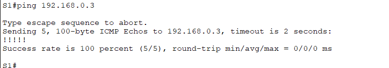

# 🌐 Nama Proyek

Folder ini digunakan untuk mengumpulkan link video Tugas Akhir Judul 2

---

## Link Video YouTube
(https://youtu.be/VCDWuFVoOe4)

## Penjelasan Ping

Ping gagal pada kasus ini dikarenakan PC-A berusaha untuk berkomunikasi dengan PC-B yang berbeda jaringan, secara default ini tidak bisa tanpa perantara alat router yang melakukan routing, karena pesan ping berusaha mencari perangkat dengan ip 192.168.0.3 tapi gak pernah ditemukan.
Selain itu, ping juga bisa gagal karena beberapa alasan lain, seperti kerusakan media pengantar. disable port, firewall, dan yang lainnya
---

Ping pada kedua gambar di atas menunjukkan sukses atau replay, yang berarti PC-A dan S1 sudah mampu berkomunikasi dengan PC-B yang berbeda jaringan, hal ini karena default-gateway yang dibuat di router, sehingga apapun ip yang masuk dari arah gateway tersebut, maka paket akan diteruskan ke alamat penerima menggunakan ip default-gateway, bukan dari ip pengirim secara langsung.
